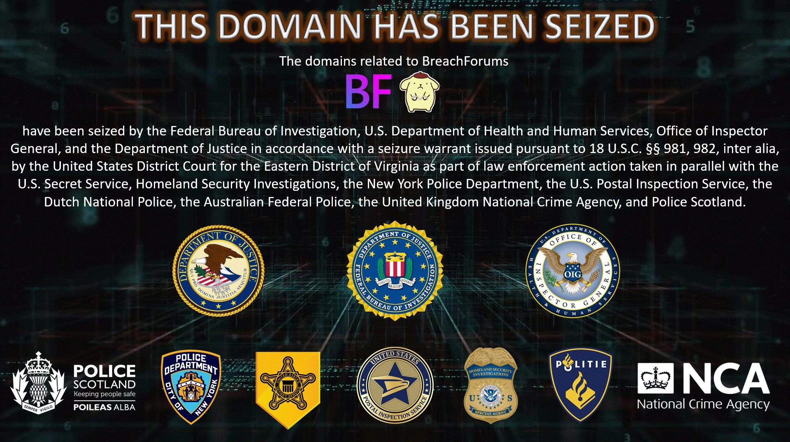

Seizure banner
=====================================================
.. glossary::
  Seizure banner : S

.. glossary::
  シージャーバナー : し

* 違法サイトのドメインを法執行機関が差し押さえたあと、サイトに表示する画面のこと
* ランサムウェアのリークサイトやハッキングフォーラムなどの跡地に表示されている
* 次の画像は、2022年に差し押さえられた `breached.vc <http://breached.vc>`_ に表示されたもの

  * 連携した法執行機関のロゴが表示されている
  * 画像引用 `http://breached.vc/banner.jpg <http://breached.vc/banner.jpg>`_ （2023年8月22日取得）

.. rubric:: 参考ツイート

.. raw:: html

  <blockquote class="twitter-tweet">
seizure banner（しーじゃーばなー）ですね。 差し押さえ印って感じでしょうか。
&mdash; 辻 伸弘 (nobuhiro tsuji) (@ntsuji) <a href="https://twitter.com/ntsuji/status/1356449592074665985?ref_src=twsrc%5Etfw">February 2, 2021</a></blockquote>  
  <blockquote class="twitter-tweet">
ときどき出てくる用語ですね。&quot;seizure banner&quot; のことで、FBI などの法執行機関が差し押さえた Web サイトに表示する画面のことです。 <a href="https://twitter.com/hashtag/%E3%82%BB%E3%82%AD%E3%83%A5%E3%83%AA%E3%83%86%E3%82%A3%E3%81%AE%E3%82%A2%E3%83%AC?src=hash&amp;ref_src=twsrc%5Etfw">#セキュリティのアレ</a>
&mdash; Masafumi Negishi (@MasafumiNegishi) <a href="https://twitter.com/MasafumiNegishi/status/1693830334402711578?ref_src=twsrc%5Etfw">August 22, 2023</a></blockquote>  

.. rubric:: 関連放送回

* `第73回 乾杯！朗報！でも注意！根岸さんのところに攻撃が！？スペシャル！`_
* `第191回 偽らない偽りもあるんだぜ！スペシャル！`_

.. _第73回 乾杯！朗報！でも注意！根岸さんのところに攻撃が！？スペシャル！: https://www.tsujileaks.com/?p=804
.. _第191回 偽らない偽りもあるんだぜ！スペシャル！: https://www.tsujileaks.com/?p=1587
