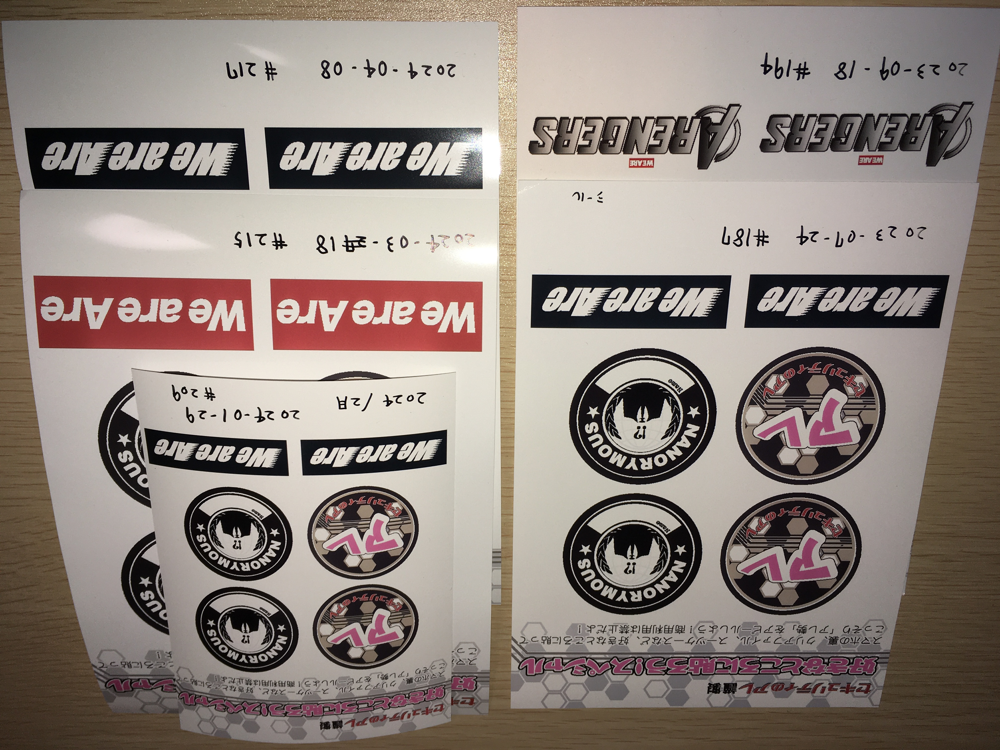

アレステッカー
=================
.. glossary::
  アレステッカー : あ

* :doc:`お便りのコーナー` でおたよりが読まれるともらえる、セキュリティのアレ謹製ステッカーのこと
* ステッカーは `コンビニのネットプリント <https://networkprint.ne.jp/sharp_netprint/ja/top.aspx>`_ (ファミマ / ローソン など) で印刷できるようになっている

  * 印刷する紙の種類 (写真用紙 / シール紙など) や大きさ (L版 / 2L版) を選ぶことができ、2L判シール紙であれば300円で印刷できる 

* 通常のステッカーは8種類用意があり、ランダムに配布されている

  * 元々、ステッカーの種類は5種類だったが `S3#313`_ (2026年8月10日公開) で8種類に増えた ( `2分20秒～ <https://listen.style/p/sec_are/zbd1rzeu?t=144.74>`_ で言及)

* 通常ステッカー8種類のうち5種類を集めたリスナー向けのスペシャルステッカーが用意されている（ `S3#180`_ および `S3#313`_ で言及）

  * スペシャルステッカーは :doc:`アイキャッチ` 関連のデザインだが、ネットで公開することは避けて欲しいとのこと

.. tip:: 
  スペシャルステッカーがもらえるまでのお便りツイート回数の期待値について

  `S3#313`_ 以前において、通常ステッカーは5種類だったので、スペシャルステッカーがもらえる条件である全5種類コンプリートまでの期待値は約11.4回だった。  
  毎週お便りを送り続け、毎週採用され続けたら3ヶ月 (12週間) 程度でコンプリートできるかもしれない計算となる。
  
  `S3#313`_ 以後は、通常ステッカー8種類の中から5種類をコンプリートするのに必要な期待値は約7.1回となる。  
  毎週お便りを送り続け、毎週採用され続けたら2ヶ月 (8週間) 程度でコンプリートできるかもしれない計算となる。

  ちなみに、通常ステッカー8種類をすべてコンプリートするのに必要な期待値は約21.7回だが、8種類を全コンプリートした場合のステッカーなどは、 `S3#313`_ 時点において用意していないとのこと。
  なお、既に5種類持っている状態から残り3種類を揃える期待値は約14.7回となる。
  
  参考サイト: `ガチャをコンプするのに必要な回数 <https://keisan.casio.jp/exec/system/1375851215>`_

.. tip:: 
  ステッカー5種類コンプリートした人について、ポッドキャスト内で度々言及されている

  * `S3#189`_ にて1人目が言及された
  * `S3#201`_ にて2人目が言及された

  以降も、ステッカー5種類コンプリートした人が出るたびにポッドキャスト内で言及されており、2、3周しているアレリスナーもいるらしい。

.. rubric:: ステッカーのデザイン（5種類）

.. raw:: html

  <blockquote class="twitter-tweet">
コンビニで印刷できる <a href="https://twitter.com/hashtag/%E3%82%BB%E3%82%AD%E3%83%A5%E3%83%AA%E3%83%86%E3%82%A3%E3%81%AE%E3%82%A2%E3%83%AC?src=hash&amp;ref_src=twsrc%5Etfw">#セキュリティのアレ</a> ステッカーは、こんな感じになりそうです！  今後どこかからのタイミングでお便りを読ませていただいた方にコードをお渡しする形にしようかと思っております。 <a href="https://t.co/wkRafKToSL">pic.twitter.com/wkRafKToSL</a>
&mdash; 辻 伸弘 (nobuhiro tsuji) (@ntsuji) <a href="https://twitter.com/ntsuji/status/1531494295877742593?ref_src=twsrc%5Etfw">May 31, 2022</a></blockquote>  
  <blockquote class="twitter-tweet">
ポッドキャスト <a href="https://twitter.com/hashtag/%E3%82%BB%E3%82%AD%E3%83%A5%E3%83%AA%E3%83%86%E3%82%A3%E3%81%AE%E3%82%A2%E3%83%AC?src=hash&amp;ref_src=twsrc%5Etfw">#セキュリティのアレ</a> でお便りを読ませていただいた方へ配布しているステッカーの新デザイン出来ました。メインは据え置きでサブにバリエーションが4つ追加です。配布は毎週ランダムって感じでいいでしょうか。どうするのがいいですかね。<a href="https://twitter.com/hashtag/%E3%82%A2%E3%83%AC%E5%8B%A2?src=hash&amp;ref_src=twsrc%5Etfw">#アレ勢</a> の方、ご意見くださると嬉しいです。 <a href="https://t.co/Sr4hG3SLl6">pic.twitter.com/Sr4hG3SLl6</a>
&mdash; 辻 伸弘 (nobuhiro tsuji) (@ntsuji) <a href="https://twitter.com/ntsuji/status/1565344618094272512?ref_src=twsrc%5Etfw">September 1, 2022</a></blockquote>  

次の画像は、私がいただいたもの。

.. rubric:: アレステッカーをキレイにカットするツール

.. raw:: html

  <blockquote class="twitter-tweet">
今日の <a href="https://twitter.com/hashtag/%E3%82%BB%E3%82%AD%E3%83%A5%E3%83%AA%E3%83%86%E3%82%A3%E3%81%AE%E3%82%B3%E3%83%AC?src=hash&amp;ref_src=twsrc%5Etfw">#セキュリティのコレ</a> の最初の方に話があったステッカーのカット、私はコレで綺麗にカットできました。<a href="https://t.co/Yd0tOWVhoH">https://t.co/Yd0tOWVhoH</a><a href="https://t.co/HuApeZScwO">https://t.co/HuApeZScwO</a><a href="https://twitter.com/hashtag/%E3%82%BB%E3%82%AD%E3%83%A5%E3%83%AA%E3%83%86%E3%82%A3%E3%81%AE%E3%82%A2%E3%83%AC?src=hash&amp;ref_src=twsrc%5Etfw">#セキュリティのアレ</a> <a href="https://twitter.com/hashtag/%E3%82%A2%E3%83%AC%E5%8B%A2?src=hash&amp;ref_src=twsrc%5Etfw">#アレ勢</a> <a href="https://twitter.com/hashtag/%E3%82%B3%E3%83%AC%E5%8B%A2?src=hash&amp;ref_src=twsrc%5Etfw">#コレ勢</a> <a href="https://t.co/bS9jxXplZR">pic.twitter.com/bS9jxXplZR</a>
&mdash; hashiken (@hashiken_com) <a href="https://twitter.com/hashiken_com/status/1934989607382462536?ref_src=twsrc%5Etfw">June 17, 2025</a></blockquote>  

.. raw:: html

.. rubric:: 関連ワード

* :doc:`お便りのコーナー`
* :doc:`VS根岸とVSかんご`

.. rubric:: 関連放送回

* `第180回 想起させるのが2つと変化の兆しが1つ！スペシャル`_
* `第189回 いきなり急にふと何気なく突然に！スペシャル！`_
* `第201回 このポッドキャストは58分37秒で聴けます！スペシャル！`_
* `第313回 「ランダム」って入力できへんねん！スペシャル！`_

.. _S3#180: https://www.tsujileaks.com/?p=1505
.. _S3#189: https://www.tsujileaks.com/?p=1576
.. _S3#201: https://www.tsujileaks.com/?p=1639

.. _第180回 想起させるのが2つと変化の兆しが1つ！スペシャル: https://www.tsujileaks.com/?p=1505
.. _第189回 いきなり急にふと何気なく突然に！スペシャル！: https://www.tsujileaks.com/?p=1576
.. _第201回 このポッドキャストは58分37秒で聴けます！スペシャル！: https://www.tsujileaks.com/?p=1639

.. _第313回 「ランダム」って入力できへんねん！スペシャル！: https://www.tsujileaks.com/?p=2351
.. _S3#313: https://www.tsujileaks.com/?p=2351