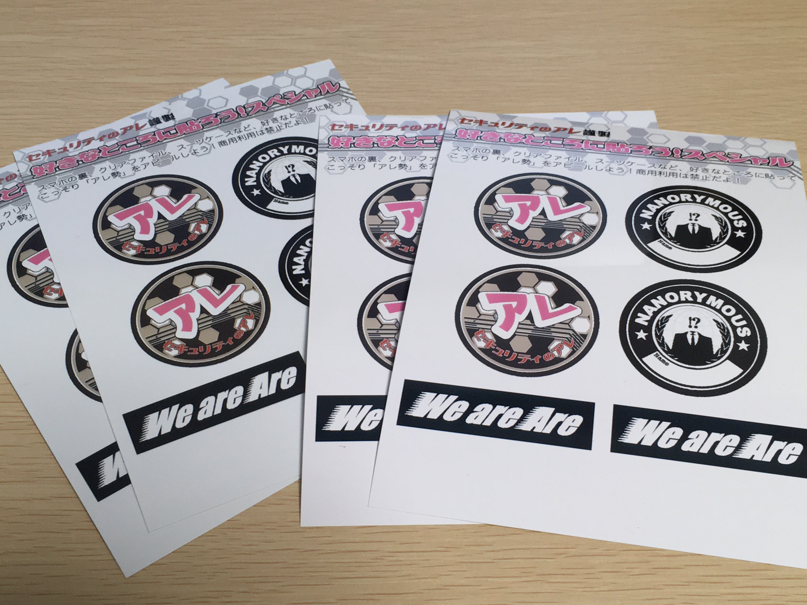

ステッカー
==========
.. glossary::
  ステッカー : す

* :doc:`お便りのコーナー` でおたよりが読まれるともらえる、セキュリティのアレ謹製ステッカーのこと
* ステッカーはコンビニのネットプリントで印刷できるようになっている
* ステッカーは全5種類だが、すべて揃えたリスナー向けのスペシャルステッカーが用意されている（第180回で言及）

  * 第189回にて、ステッカー全5種類コンプリートした人いることが報告された
  * スペシャルステッカーは :doc:`アイキャッチ` 関連のデザインだが、全公開することは避けて欲しいとのこと

.. rubric:: ステッカーのデザイン（5種類）

.. raw:: html

  <blockquote class="twitter-tweet">
コンビニで印刷できる <a href="https://twitter.com/hashtag/%E3%82%BB%E3%82%AD%E3%83%A5%E3%83%AA%E3%83%86%E3%82%A3%E3%81%AE%E3%82%A2%E3%83%AC?src=hash&amp;ref_src=twsrc%5Etfw">#セキュリティのアレ</a> ステッカーは、こんな感じになりそうです！  今後どこかからのタイミングでお便りを読ませていただいた方にコードをお渡しする形にしようかと思っております。 <a href="https://t.co/wkRafKToSL">pic.twitter.com/wkRafKToSL</a>
&mdash; 辻 伸弘 (nobuhiro tsuji) (@ntsuji) <a href="https://twitter.com/ntsuji/status/1531494295877742593?ref_src=twsrc%5Etfw">May 31, 2022</a></blockquote>  
  <blockquote class="twitter-tweet">
ポッドキャスト <a href="https://twitter.com/hashtag/%E3%82%BB%E3%82%AD%E3%83%A5%E3%83%AA%E3%83%86%E3%82%A3%E3%81%AE%E3%82%A2%E3%83%AC?src=hash&amp;ref_src=twsrc%5Etfw">#セキュリティのアレ</a> でお便りを読ませていただいた方へ配布しているステッカーの新デザイン出来ました。メインは据え置きでサブにバリエーションが4つ追加です。配布は毎週ランダムって感じでいいでしょうか。どうするのがいいですかね。<a href="https://twitter.com/hashtag/%E3%82%A2%E3%83%AC%E5%8B%A2?src=hash&amp;ref_src=twsrc%5Etfw">#アレ勢</a> の方、ご意見くださると嬉しいです。 <a href="https://t.co/Sr4hG3SLl6">pic.twitter.com/Sr4hG3SLl6</a>
&mdash; 辻 伸弘 (nobuhiro tsuji) (@ntsuji) <a href="https://twitter.com/ntsuji/status/1565344618094272512?ref_src=twsrc%5Etfw">September 1, 2022</a></blockquote>  

次の画像は、私がいただいたもの。

.. rubric:: 関連ワード

* :doc:`お便りのコーナー`

.. rubric:: 関連放送回

* `第180回 想起させるのが2つと変化の兆しが1つ！スペシャル <https://www.tsujileaks.com/?p=1505>`_
* `第189回 いきなり急にふと何気なく突然に！スペシャル！ <https://www.tsujileaks.com/?p=1576>`_ 
